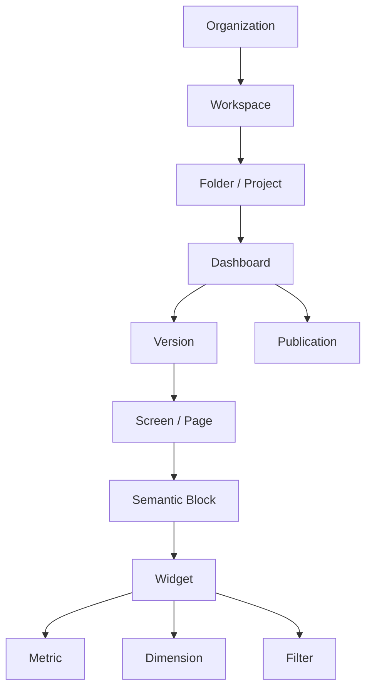
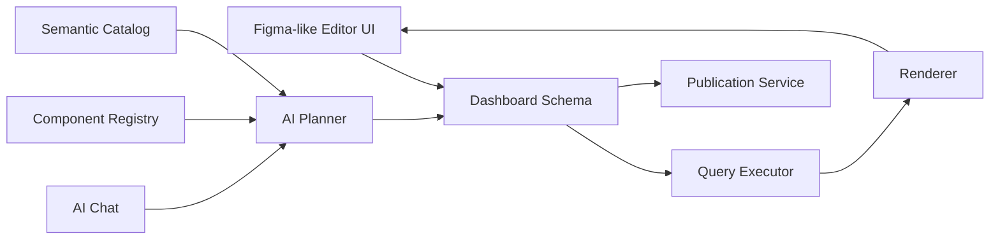

# AI Dashboard Studio P0 Specification

Версия: 0.1  
Дата: 2026-07-07  
Вертикаль P0: Топливный комплекс Москвы  
Основной формат: executive dashboard 16:9  
Ключевое ограничение UI: редактор остается в Figma-like компоновке: top menu, слева AI-чат, центр canvas с рабочим листом, справа inspector, снизу toolbar.

## 1. Цель P0

P0 должен доказать, что продукт умеет пройти один полный сценарий от управленческого запроса до опубликованного дашборда:

1. Пользователь создает дашборд через короткий бриф.
2. Система открывает Figma-like редактор с пустым или шаблонным листом.
3. Пользователь добавляет смысловые блоки и комментарии.
4. AI-планировщик связывает задачу с метриками, фильтрами, виджетами и layout.
5. Пользователь дорабатывает экран через холст, inspector и AI-чат.
6. Система проверяет данные, визуальное качество, доступы и публикацию.
7. Пользователь публикует интерактивный dashboard, meeting screen, TV-mode или экспорт.

Главный принцип P0: не строить универсальную замену Power BI, а показать один сильный вертикальный сценарий с архитектурой, которую можно расширять.

## 2. Product Formula

Пользователь формулирует управленческий вопрос и собирает логику экрана из смысловых блоков. AI Dashboard Studio превращает эту логику в проверяемую dashboard schema: данные, метрики, фильтры, виджеты, layout, визуальные правила и trust metadata.

Не делать:

- выбирать график первым действием;
- заставлять пользователя вручную настраивать оси;
- генерировать произвольную картинку без схемы;
- давать AI право молча ломать ручную работу.

Делать:

- начинать с задачи, аудитории и формата;
- работать со смысловыми блоками;
- компилировать dashboard из registry components;
- показывать diff перед крупными AI-правками;
- хранить trust panel для каждого значения.

## 3. P0 Scope

### In Scope

- Workspace и список дашбордов.
- Создание дашборда через brief modal.
- Figma-like dashboard editor.
- Холст 16:9.
- AI-chat как левый side panel.
- Design/data inspector справа.
- Bottom toolbar для комментариев, листов, форм, стрелок, текста, виджетов, карты, сборки.
- Dashboard schema JSON.
- Semantic metric catalog.
- Widget registry на 20-25 компонентов.
- Основные filters: период, компания, район, статус, вид топлива.
- Готовые композиции для топлива Москвы.
- CSV и PostgreSQL как первые data inputs.
- Mock mode без внешних ключей.
- Trust panel.
- Версии.
- Комментарии.
- Publish checklist.
- PNG/PDF export placeholder.

### Out of Scope

- 100+ графиков.
- Совместное редактирование уровня Figma.
- Marketplace.
- Произвольные пользовательские виджеты.
- Полный SQL editor для бизнес-пользователей.
- Все GIS-слои и сложный spatial analysis.
- Power BI-level report builder.
- Реальный streaming/Kafka.
- SSO enterprise matrix.
- Полный Gantt engine.

## 4. Primary Users in P0

### Руководитель

Задачи:

- открыть опубликованный executive screen;
- переключить период, сеть, район, статус;
- увидеть риски и причины;
- спросить AI, что изменилось;
- оставить комментарий;
- запросить meeting version.

P0 права:

- view;
- comment;
- save view;
- ask AI over dashboard context.

### Аналитик

Задачи:

- создать dashboard;
- выбрать или подтвердить метрики;
- собрать блоки;
- проверить расчеты;
- настроить фильтры;
- подготовить публикацию.

P0 права:

- create;
- edit layout;
- bind metrics;
- publish draft for review.

### BI-дизайнер

Задачи:

- настроить тему;
- проверить читаемость 16:9;
- исправить hierarchy;
- закрепить visual rules.

P0 права:

- edit theme;
- edit component styling;
- create template from dashboard.

### Data Steward

Задачи:

- подтвердить метрики;
- задать формулы;
- описать источники;
- проверить freshness и quality.

P0 права:

- manage semantic catalog;
- approve metrics;
- view lineage.

## 5. Core Entities



### Dashboard

```ts
type Dashboard = {
  id: string;
  title: string;
  description?: string;
  audience: "executive" | "analyst" | "operations" | "meeting";
  format: "16:9" | "16:10" | "21:9" | "32:9" | "9:16" | "mobile" | "free";
  themeId: string;
  semanticModelId: string;
  pages: DashboardPage[];
  globalFilters: FilterSpec[];
  permissions: PermissionSpec[];
  status: "draft" | "review" | "published" | "archived";
  createdAt: string;
  updatedAt: string;
};
```

### Page

```ts
type DashboardPage = {
  id: string;
  name: string;
  format: Dashboard["format"];
  width: number;
  height: number;
  grid: {
    columns: number;
    rows: number;
    gutter: number;
    margin: number;
  };
  blocks: SemanticBlockSpec[];
  annotations: AnnotationSpec[];
};
```

### Semantic Block

```ts
type SemanticBlockSpec = {
  id: string;
  role:
    | "current_situation"
    | "where_problem"
    | "why_changed"
    | "forecast"
    | "risks"
    | "actions"
    | "detail";
  title: string;
  intent: string;
  constraints: string[];
  layout: GridRect;
  widgets: WidgetSpec[];
  aiNotes: string[];
  locked?: boolean;
};
```

### Widget

```ts
type WidgetSpec = {
  id: string;
  componentId: string;
  title: string;
  metricBindings: MetricBinding[];
  dimensions: string[];
  filters: FilterBinding[];
  visual: VisualSpec;
  behavior: BehaviorSpec;
  trust: TrustSpec;
  layout: GridRect;
};
```

## 6. Screen-by-Screen P0 UX

### 6.1. My Dashboards

Route: `/dashboards`

Purpose: стартовая рабочая зона, не редактор.

Required UI:

- mos.bi logo;
- top navigation: My dashboards, Team, Templates, Comments;
- primary action: Create dashboard;
- large creation tile;
- tabs: Recent, Drafts, Published, Favorites, Versions and comments;
- dashboard cards;
- ready compositions card.

Acceptance criteria:

- User sees at least 3 dashboard cards.
- Create action opens brief modal.
- Mobile layout remains readable.
- No empty editor is shown before context exists.

### 6.2. Create Dashboard Brief

Trigger: Create dashboard.

Required fields:

- title;
- audience;
- screen format;
- task;
- visual mode;
- optional advanced settings.

Default P0 values:

- Title: Топливный комплекс — еженедельный обзор
- Audience: Руководитель / совещание
- Format: Совещание — 16:9
- Task: Показать текущую ситуацию, дефицит, риски по сетям и территориям, причины отклонений и прогноз на неделю
- Visual mode: Executive dark

Acceptance criteria:

- Modal has no more than 5 primary inputs.
- Advanced settings are collapsed by default.
- Continue opens editor with AI memory pre-filled.

### 6.3. Figma-like Editor

Routes:

- `/dashboards/editor`
- `/dashboards/assembled`

Layout lock:

```text
Top menu
┌──────────────┬──────────────────────────────┬──────────────┐
│ AI Chat      │ Canvas stage                  │ Inspector    │
│              │ Center dashboard sheet        │              │
└──────────────┴──────────────────────────────┴──────────────┘
Bottom toolbar
```

Do not change this layout direction.

Required zones:

1. Top menu
   - File
   - Edit
   - Insert
   - View
   - Data
   - Publish
   - dashboard title
   - versions
   - preview
   - publish

2. Left AI chat
   - source brief;
   - audience;
   - format;
   - style;
   - constraints;
   - AI history;
   - chat input.

3. Center canvas
   - grid background;
   - centered 16:9 sheet;
   - page label;
   - zoom control;
   - grid/snap toggles;
   - semantic blocks on sheet.

4. Right inspector
   - Design/Data/Prototype tabs;
   - selection;
   - position and size;
   - theme;
   - fill;
   - stroke;
   - radius;
   - opacity;
   - shadow;
   - effects;
   - widget intent;
   - future: data binding and access.

5. Bottom toolbar
   - comments;
   - new sheet;
   - shape;
   - arrow;
   - text;
   - widget;
   - map;
   - presentation;
   - build action.

Acceptance criteria:

- At 1440x1000 the whole 16:9 sheet is visible.
- Left AI-chat and right inspector do not overlap the sheet.
- Bottom toolbar is always visible.
- Build button opens compilation modal.
- Publish button opens publish checklist.

### 6.4. Build Modal

Trigger: Build dashboard.

Required content:

- number of blocks;
- approved metrics count;
- period/comparison;
- theme and format;
- quality checks.

Copy:

```text
Соберу дашборд из 6 блоков
Подключу 11 утвержденных метрик
Добавлю сравнение с прошлой неделей
Применю Executive dark и формат 16:9
Проверю читаемость, дубли и пустые данные
```

Acceptance criteria:

- User understands this is dashboard compilation, not image generation.
- User can cancel.
- User can run assembly.

### 6.5. AI Diff After Assembly

Required behavior:

- AI does not silently replace the user layout.
- Major edits appear as a diff panel.
- User can accept all or accept separately.

Example P0 diff:

1. Увеличить карту риска с 6 до 8 колонок
2. Заменить круговую диаграмму на рейтинг районов
3. Перенести прогноз в правую колонку
4. Сократить текстовый вывод до 3 тезисов

Acceptance criteria:

- Diff appears after build.
- Existing manual blocks remain visible.
- Locked blocks are marked.

### 6.6. Publish Checklist

Trigger: Publish.

Checks:

- data exists in every widget;
- source freshness is acceptable;
- no conflicting filters;
- no unapproved metrics;
- user permissions are valid;
- 16:9 readability is valid;
- text does not overflow;
- trust metadata exists.

Publish modes:

- interactive dashboard;
- meeting screen;
- TV mode;
- mobile version;
- internal portal;
- embedded widget;
- PDF;
- PNG;
- restricted link;
- template.

Acceptance criteria:

- Publish modal shows checklist.
- User can choose publication mode.
- Published state is represented in dashboard metadata.

## 7. P0 Vertical Scenario: Fuel Complex Moscow

### User Request

```text
Нужен экран по доступности топлива в Москве: текущая ситуация, закрытые АЗС, очереди, риски по сетям, районы с проблемами и прогноз на неделю.
```

### Required Dashboard Structure

1. Executive header
   - title;
   - period;
   - last update;
   - global filters.

2. Current situation
   - total stations;
   - available stations;
   - closed: no fuel;
   - closed: other reasons;
   - critical risk count.

3. Fuel availability dynamics
   - multiline chart;
   - open / no fuel / other;
   - daily or hourly granularity;
   - forecast optional.

4. Map of risk
   - districts;
   - stations;
   - status colors;
   - drill panel for station.

5. Queue by network
   - bar ranking;
   - selected company state.

6. Network status distribution
   - stacked bars;
   - open / no fuel / other reasons.

7. Reasons
   - Pareto or stacked bar;
   - reason categories.

8. Forecast
   - line with forecast segment;
   - confidence note.

9. AI executive summary
   - what changed;
   - what requires attention;
   - recommended actions.

### P0 Filters

Global:

- period;
- fuel type;
- company network;
- district;
- status.

Block-level:

- map layer;
- top-N district ranking;
- forecast horizon.

Local:

- selected station;
- selected reason category.

### Filter Behavior

P0 key interaction:

When user selects company `Лукойл`, the system updates:

- availability KPI;
- queue chart;
- station map;
- reason distribution;
- station list.

System keeps as context:

- city-wide forecast;
- city-wide total benchmark.

## 8. P0 Widget Registry

P0 implements 25 widget/component families, not 100 random charts.

### KPI and Status

1. KPI card
2. KPI with delta
3. KPI with sparkline
4. KPI with threshold
5. Plan/fact KPI
6. Progress bar
7. Risk indicator
8. Data freshness indicator
9. Data quality indicator
10. Object counter

### Time Dynamics

11. Line chart
12. Multi-line chart
13. Line with forecast
14. Line with plan
15. Sparkline
16. Event timeline

### Comparison and Structure

17. Horizontal ranking bar
18. Vertical bar chart
19. Stacked bar
20. 100% stacked bar
21. Bullet chart
22. Pareto chart

### Geo

23. Choropleth map
24. Point map
25. Map + ranking block

### Detail and Narrative

26. Ranked table
27. Exception table
28. AI summary
29. What changed
30. What to do

P0 can ship 25 visible components if some registry entries share the same rendering engine with different presets.

## 9. Component Passport

Every component in the registry must include:

```ts
type ComponentPassport = {
  id: string;
  name: string;
  family: string;
  purpose: string;
  requiredFields: string[];
  optionalFields: string[];
  minSize: GridSize;
  maxSize?: GridSize;
  mobileVariant: string;
  supportedFilters: string[];
  supportedThemes: string[];
  states: string[];
  constraints: string[];
  compatibleComponents: string[];
  recommendedScenarios: string[];
  accessibilityRules: string[];
  trustMetadataRequired: string[];
};
```

Example: Gantt is not P0, but the registry should already reserve the shape of its passport:

```ts
const ganttPassport = {
  requiredFields: ["task", "startDate", "endDate", "status", "owner"],
  optionalFields: ["dependency", "milestone", "baseline", "risk", "progress"],
  minSize: { columns: 6, rows: 4 },
  mobileVariant: "task_list_with_milestones",
  constraints: ["Do not use inside small KPI tile", "Requires time dimension"],
};
```

## 10. Semantic Layer P0

### P0 Sources

- CSV
- Excel import placeholder
- PostgreSQL
- mock dataset

### Metric Fields

```ts
type MetricDefinition = {
  id: string;
  name: string;
  description: string;
  formula: string;
  unit: string;
  grain: string;
  refreshInterval: string;
  sourceId: string;
  owner: string;
  dimensions: string[];
  limitations: string[];
  accessPolicy: string;
  comparisonRules: string[];
  changeHistory: ChangeLogEntry[];
};
```

### P0 Fuel Metrics

1. Total stations
2. Available stations
3. Availability rate
4. Closed stations: no fuel
5. Closed stations: other reasons
6. Critical risk stations
7. Queue count
8. Queue rate
9. Average restoration time
10. Forecasted availability
11. Data freshness

### Example Metric

```yaml
id: fuel_availability_rate
name: Доступность АЗС
formula: open_station_count / total_station_count
unit: percent
grain: station_day
refreshInterval: 15 minutes
owner: Топливный комплекс
dimensions:
  - company
  - district
  - fuel_type
  - date
  - status
limitations:
  - Не использовать для сравнения районов с менее чем 5 АЗС
accessPolicy: fuel_analytics_read
```

## 11. Trust Panel P0

Every widget has `Откуда цифра`.

Required fields:

- source;
- last updated;
- metric formula;
- filters applied;
- transformations;
- metric owner;
- methodology link;
- query ID;
- data quality status;
- visibility for current user.

Acceptance criteria:

- Trust panel opens from any widget.
- Trust panel shows at least source, formula, filters, updatedAt, owner.
- AI summary links to evidence widgets.

## 12. AI Planner P0

### Inputs

- dashboard brief;
- audience;
- format;
- selected semantic blocks;
- widget comments;
- metric catalog;
- component registry;
- allowed data sources;
- theme;
- locked manual edits.

### Outputs

```ts
type DashboardPlan = {
  questions: string[];
  selectedMetrics: string[];
  selectedFilters: FilterSpec[];
  blocks: SemanticBlockSpec[];
  layoutDecisions: LayoutDecision[];
  rejectedOptions: RejectedDecision[];
  warnings: PlanWarning[];
  diff: ProposedChange[];
};
```

### AI Must Do

- turn request into dashboard structure;
- ask clarifying questions when needed;
- find approved metrics;
- choose components from registry;
- generate filters and influence scope;
- propose 2-4 layout options in future P1;
- explain major choices;
- create AI summary linked to data;
- show diff before major changes.

### AI Must Not Do

- change approved metric formulas;
- use unauthorized data;
- hide assumptions;
- create invalid query specs;
- overwrite locked blocks;
- produce unsupported component specs;
- create narrative without evidence.

## 13. Layout Engine P0

The layout engine does not need to solve arbitrary auto-layout. It must solve one class well: executive 16:9 dashboard.

Inputs:

- page format;
- block roles;
- component passports;
- min/max sizes;
- priority;
- locked positions;
- density mode;
- theme.

Rules:

- KPI/status blocks stay near the top.
- Map/ranking gets large enough area.
- AI summary does not dominate unless meeting mode.
- No widget below passport minimum size.
- No text overflow in 16:9.
- Filters are placed as separate objects.
- Locked blocks are not moved without diff.

Output:

- grid positions;
- component variants;
- density settings;
- warnings.

## 14. Data Model for Filters

```ts
type FilterSpec = {
  id: string;
  name: string;
  type:
    | "period"
    | "date_range"
    | "company"
    | "district"
    | "status"
    | "fuel_type"
    | "search_select"
    | "scenario"
    | "top_n";
  level: "global" | "section" | "local";
  defaultValue?: unknown;
  multi?: boolean;
  influenceScope: string[];
  visibleInPublished: boolean;
  urlBinding?: string;
  conflictRules: ConflictRule[];
};
```

P0 filter UX:

- filters can sit on canvas;
- filters can affect selected blocks;
- inspector shows influence scope;
- AI can explain "this filter affects these widgets".

## 15. Comments P0

Comment targets:

- dashboard;
- page;
- block;
- widget;
- filter;
- value;
- canvas point;
- version.

Comment types:

- manual note;
- task;
- question to analyst;
- question to data owner;
- AI instruction;
- review issue;
- decision log.

P0 behavior:

- bottom toolbar has comments tool;
- user can attach comment to selected block;
- comments appear in AI chat context;
- comments are stored with version.

## 16. Versioning P0

Version events:

- dashboard created;
- brief changed;
- AI build run;
- block added;
- widget changed;
- filter changed;
- published;
- export created.

Each version stores:

- schema snapshot;
- author;
- timestamp;
- change summary;
- optional AI diff.

## 17. Export and Publication P0

Publication object:

```ts
type Publication = {
  id: string;
  dashboardId: string;
  versionId: string;
  mode:
    | "interactive"
    | "meeting"
    | "tv"
    | "mobile"
    | "portal"
    | "embed"
    | "pdf"
    | "png"
    | "template";
  accessPolicy: string;
  createdAt: string;
  createdBy: string;
};
```

P0 modes:

- interactive;
- meeting screen;
- TV mode;
- PDF;
- PNG;
- template.

P1 modes:

- mobile;
- portal;
- embed;
- restricted link with expiry.

## 18. Technical Architecture P0



### Frontend

- Next.js app router.
- React components.
- CSS/Tailwind-compatible global tokens.
- Code-native canvas prototype for P0.
- Reusable dashboard-kit components.

### Backend P0

- `/api/plan`: AI planner or demo planner.
- `/api/data`: query execution or mock data.
- Semantic YAML catalog.
- PostgreSQL readonly connector.
- CSV import placeholder.

### Storage P0

Can start local/mock, but schema should anticipate:

- dashboards table;
- versions table;
- comments table;
- metrics table;
- publications table;
- data sources table.

## 19. P0 Milestones

### M1: Product Shell

- My dashboards.
- Create dashboard modal.
- Figma-like editor.
- Save local draft.
- Preview routes.

Done when:

- user can create a dashboard and land in editor;
- editor layout is stable at 1440x1000 and mobile.

### M2: Schema and Registry

- Dashboard schema types.
- Component passport registry.
- 25 P0 widgets registered.
- Fuel dashboard template schema.

Done when:

- dashboard can be serialized/deserialized;
- registry validates widget requirements.

### M3: Semantic Layer

- fuel metrics YAML;
- PostgreSQL mock adapter;
- CSV import placeholder;
- trust metadata fields.

Done when:

- each P0 widget can resolve its metric binding;
- missing metric produces visible warning.

### M4: AI Planner

- prompt-to-blocks;
- metric selection;
- layout suggestion;
- diff generation;
- lock preservation.

Done when:

- build action returns dashboard plan;
- major changes show diff.

### M5: Fuel Dashboard Render

- KPI stack;
- availability line chart;
- queue ranking;
- company distribution;
- map placeholder;
- AI summary;
- filters.

Done when:

- first vertical dashboard is visually publishable in 16:9.

### M6: Review and Publish

- comments;
- versions;
- publish checklist;
- PDF/PNG placeholder;
- trust panel.

Done when:

- user can review, publish and export the dashboard.

## 20. Acceptance Criteria for P0

P0 is successful if:

1. A user can create the fuel dashboard from a short brief.
2. AI produces a structured dashboard schema, not a screenshot.
3. At least 20 registry components exist, with passports.
4. At least 8 components are rendered in the fuel dashboard.
5. Global filters update scoped widgets.
6. Every widget has trust metadata.
7. Manual locked edits are preserved.
8. AI major changes are shown as diff.
9. Dashboard passes publish checklist.
10. The result can be shown as a credible executive 16:9 dashboard.

## 21. Immediate Next Implementation Tasks

1. Convert current editor prototype to schema-driven rendering.
2. Add `dashboard-schema.ts` with types.
3. Add `component-registry.ts` with P0 passports.
4. Add `fuel-dashboard-template.ts`.
5. Add a persistent metric catalog for fuel metrics.
6. Add trust panel UI for selected widget.
7. Make bottom toolbar tools update local editor state.
8. Add comments as objects on canvas.
9. Add publish checklist state.
10. Replace static assembled preview with schema-generated dashboard plan.
